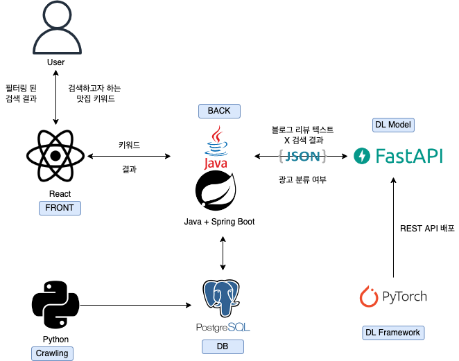

# 딥러닝 기반 맛집 광고 리뷰 필터링 서비스: 찐맛집
찐맛집은 BERT 기반 모델으로 네이버 맛집 리뷰 중 광고일 가능성이 높은 게시글을 필터링하는 서비스 입니다.
PyTorch 텍스트 분류 모델을 REST API로 배포하기 위한 저장소 입니다. FastAPI를 사용하였습니다.

## Tech Stack

**Client:** React

**Server:** Java Spring Boot

**Classifier** Pytorch

**Classifier Server** Fast API


## Architecture


## API Reference
### ReqeustBody로 전달한 블로그 포스팅에 대한 광고 여부, 확률값을 반환
```http request
   POST /predict
```
#### Reqeust Body
```json
[
    {
        "id": 0,
        "text": "...토요일 오후 2시 반쯤? 근데도 앞에 웨이팅이 24팀....... 어마어마합니다...."
    },
    {
        "id": 1,
        "text": "...여기는 분위기도 힙하고 가게의 음식 맛도 좋아서 조만간 또 방문할 것 같은 그런 곳이에요..."
    }
]
```
#### Response Body
```json
[
    {
        "id": 0,
        "text": "...토요일 오후 2시 반쯤? 근데도 앞에 웨이팅이 24팀....... 어마어마합니다....",
        "ad": 0,
        "probability": 0.8768
    },
    {
        "id": 1,
        "text": "...여기는 분위기도 힙하고 가게의 음식 맛도 좋아서 조만간 또 방문할 것 같은 그런 곳이에요...",
        "ad": 1,
        "probability": 0.976357
    }
]
```

## Screenshots


